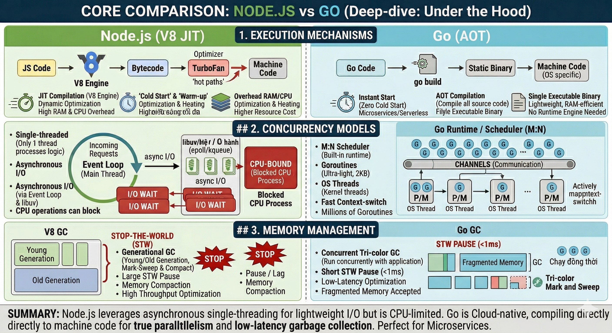

# 🚀 Phân tích Chuyên sâu: Go vs Node.js (Core Deep-dive)

Tài liệu này cung cấp một bộ khung phân tích toàn diện (Deep-Dive Framework) và các chi tiết kỹ thuật "dưới mui xe" để so sánh Go và Node.js.

---

## 🗺️ Bản Đồ Wiki & Hệ Sinh Thái Học Tập (Wiki Navigation Hub)

| Trang Chủ | So Sánh Core | So Sánh Framework | Kỹ Thuật Nâng Cao | Lộ Trình Thực Hành |
| :---: | :---: | :---: | :---: | :---: |
| 🏠 **[Trang Chủ (Wiki Root)](./README.md)** | 📊 **[Go vs Node.js Core](./GO_NODEJS.md)** | 🚀 **[Echo vs Gin vs NestJS vs Express](./framework-comparison/README.md)** | 🛠️ **[14 Kỹ Thuật Go Luyện Tập](./go-techniques/README.md)** | 🎯 **[20 Bài Tập Tự Luyện](./exercises/README.md)** |

---

## 📖 Bảng Chú Thích Thuật Ngữ (Glossary)

| Viết tắt | Ý nghĩa | Giải thích |
| :--- | :--- | :--- |
| **AOT** | Ahead-Of-Time | Biên dịch mã nguồn thành mã máy trước khi chạy. |
| **JIT** | Just-In-Time | Biên dịch mã nguồn thành mã máy ngay lúc đang chạy ứng dụng. |
| **GC** | Garbage Collection | Cơ chế tự động dọn dẹp bộ nhớ (thu gom rác). |
| **STW** | Stop-The-World | Thời điểm ứng dụng tạm dừng để trình dọn rác (GC) làm việc. |
| **I/O** | Input/Output | Các tác vụ liên quan đến nhập xuất dữ liệu (đọc file, gọi network). |
| **CPU-bound**| Tác vụ tốn CPU | Các công việc nặng về tính toán (mã hóa, nén dữ liệu). |
| **I/O-bound** | Tác vụ tốn I/O | Các công việc phải chờ đợi dữ liệu (gọi database, API). |
| **BFF** | Backend For Frontend | Lớp backend trung gian phục vụ riêng cho một giao diện (Web/Mobile). |
| **DX** | Developer Experience | Trải nghiệm của lập trình viên khi sử dụng ngôn ngữ/công cụ. |
| **LIFO** | Last In, First Out | Vào sau ra trước (nguyên tắc của lệnh `defer` trong Go). |
| **EKS** | Elastic Kubernetes Service | Dịch vụ quản lý Kubernetes của AWS. |
| **M:N** | M-to-N Scheduler | Cơ chế điều phối M luồng người dùng lên N luồng hệ thống. |
| **Static Binary**| File nhị phân tĩnh | Một file thực thi duy nhất chứa mọi thư viện cần thiết để chạy. |

---

## 🏗️ 1. Khung Phân Tích (Deep-Dive Framework)

Để đánh giá chính xác, chúng ta phân tích dựa trên 6 khía cạnh cốt lõi của một hệ thống backend:

1. **Kiến trúc & Mô hình cốt lõi**: JIT vs AOT, Single-thread Event Loop vs Multi-thread Goroutines.
2. **Hiệu năng & Khả năng mở rộng**: Tối ưu I/O so với tính toán CPU-bound.
3. **Thiết kế ngôn ngữ & DX**: Type system, Error handling, Composition over Inheritance.
4. **Hệ sinh thái & Công cụ**: npm vs Go Modules, Standard library (Batteries-included).
5. **Triển khai & Vận hành**: Binary đơn nhất vs Runtime engine, kích thước Docker image.
6. **Ứng dụng thực tiễn**: BFF/Real-time (Node) vs Cloud-native/Microservices (Go).

---

## ⚙️ 2. Đi sâu vào Tri thức Cốt lõi (Under the Hood)

### A. Cơ chế thực thi: JIT vs AOT
- **Node.js (JIT Compilation với V8 Engine):**
    - Code được dịch sang Bytecode, sau đó V8 TurboFan theo dõi các "hot paths" để dịch sang mã máy lúc runtime.
    - **Ưu điểm:** Tối ưu hóa động dựa trên dữ liệu thực tế.
    - **Đánh đổi:** Có "Cold Start" (cần thời gian làm nóng) và tiêu tốn RAM/CPU cho trình compiler chạy ngầm.
- **Go (AOT Compilation):**
    - Biên dịch trực tiếp toàn bộ source code thành **Statically Linked Binary** trước khi chạy.
    - **Ưu điểm:** Khởi động tức thì (Zero Cold Start), lý tưởng cho Serverless. Không tốn tài nguyên chạy compiler lúc runtime.
    - **Đánh đổi:** Thời gian build lâu hơn một chút so với chạy script.

### B. Mô hình Đồng thời (Concurrency)
- **Node.js (Event Loop + Async I/O):**
    - Chạy trên một luồng chính duy nhất. Sử dụng `libuv` để đẩy I/O xuống OS.
    - **Điểm nghẽn:** Bất kỳ tác vụ CPU-bound nào (parse JSON cực lớn, xử lý ảnh) sẽ "chặn đứng" toàn bộ Event Loop, làm treo các request khác.
- **Go (M:N Scheduler + Goroutines):**
    - **Goroutines:** Siêu nhẹ (~2KB), cho phép chạy hàng triệu luồng song song.
    - **M:N Scheduler:** Tự động điều phối M Goroutines lên N luồng OS (tận dụng tối đa đa nhân). 
    - **Triết lý:** "Đừng giao tiếp bằng cách chia sẻ bộ nhớ; hãy chia sẻ bộ nhớ bằng cách giao tiếp (Channels)". Giảm thiểu Race Condition.

### C. Quản trị bộ nhớ (Memory Management & GC)
- **Node.js (Tối ưu Thông lượng - High Throughput):**
    - Phân chia bộ nhớ thành nhiều thế hệ (Young/Old). Khi dọn rác (Compact) thường gây ra hiện tượng "Stop-The-World" lâu, dẫn đến các cú "giật lag" (latency spikes) nếu heap lớn.
- **Go (Tối ưu Độ trễ thấp - Ultra-Low Latency):**
    - Chạy GC đồng thời (Concurrent) with ứng dụng. Mục tiêu tối thượng là giữ thời gian dừng máy dưới **1ms**. 
    - **Hệ quả:** Latency cực kỳ ổn định và có thể dự đoán được, phù hợp cho hệ thống yêu cầu phản hồi nhanh liên tục.

---

## 📊 3. Hiệu năng & Khả năng mở rộng (Performance & Scalability)

Hiệu năng không chỉ đơn thuần là "ngôn ngữ nào chạy nhanh hơn", mà là cách mỗi nền tảng phản ứng dưới các loại tải (workload) khác nhau và giới hạn phần cứng của chúng nằm ở đâu.

### 1. Cuộc chiến I/O (I/O-Bound): Xử lý hàng vạn kết nối đồng thời
- **Node.js (Non-blocking I/O & libuv):** Ủy quyền việc chờ đợi cho hệ điều hành thông qua thư viện `libuv`. **Giới hạn:** Nếu kết quả trả về quá lớn, việc parse dữ liệu sẽ block luồng chính.
- **Go (Goroutines & netpoller):** Một Goroutine bị chặn nhưng Thread hệ điều hành vẫn chạy các Goroutine khác. **Lợi thế:** Mã nguồn viết trông "đồng bộ" nhưng thực tế chạy song song vạn Goroutines với chi phí cực thấp.

| Tiêu chí | 🟢 Node.js | 🔵 Go (Golang) |
| :--- | :--- | :--- |
| **Cơ chế** | Event Loop + libuv | Goroutines + netpoller |
| **Phong cách code** | Asynchronous (Callback/Promise) | Synchronous-style (Tuần tự) |
| **Rủi ro** | Chặn Event Loop khi data lớn | Hầu như không có |

### 2. Cuộc chiến CPU (CPU-bound): Khi tính toán là nút thắt
- **Node.js (Giới hạn Đơn luồng):** Một vòng lặp tính toán nặng sẽ khiến server "đứng hình" hoàn toàn. Việc dùng `Worker Threads` phức tạp.
- **Go (Tận dụng Đa nhân Tự nhiên):** Tốc độ thuần túy nhanh hơn JS. Nếu server có 16 nhân, Go sẽ dùng hết 16 nhân.

| Tiêu chí | 🟢 Node.js | 🔵 Go (Golang) |
| :--- | :--- | :--- |
| **Tận dụng CPU** | Đơn nhân (mặc định) | Đa nhân (native) |
| **Tính toán nặng** | Chặn Event Loop | Chạy song song |

### 3. Mức tiêu thụ RAM & Hiện tượng phân mảnh
- **Node.js:** Tốn 30-50MB RAM khởi động. Khi RAM đầy, "Stop-The-World" GC gây ra hiện tượng giật lag ở p99.
- **Go:** Chạy với < 5MB RAM. Mỗi Goroutine chỉ tốn ~2KB RAM.

| Tiêu chí | 🟢 Node.js | 🔵 Go (Golang) |
| :--- | :--- | :--- |
| **RAM khởi động** | 30MB - 50MB | < 5MB |
| **Độ trễ khi dọn rác** | Cao (STW dài) | Cực thấp (STW < 1ms) |

### 4. Chiến lược Mở rộng quy mô (Scaling)
- **Scale Up (Dọc):** Go tự động tận dụng 100% tài nguyên đa nhân. Node.js phải dùng `cluster` phức tạp.
- **Scale Out (Ngang - K8s):** Docker Image của Go siêu nhỏ (<15MB), Cold Start cực nhanh (<10ms).

| Tiêu chí | 🟢 Node.js | 🔵 Go (Golang) |
| :--- | :--- | :--- |
| **Mở rộng dọc** | Khó (Cần nhiều process) | Dễ (Native multi-core) |
| **Docker Image** | Lớn (150MB - 300MB) | Siêu nhỏ (< 20MB) |
| **Cold Start** | Trung bình (~300ms) | Cực nhanh (< 10ms) |

---

## 🛠️ 4. Hệ sinh thái & Công cụ (Ecosystem & Tooling)

### 1. Cuộc chiến Hệ sinh thái: "Chợ trời khổng lồ" vs "Đồ nghề chuyên dụng"

- **Node.js (NPM):** Khổng lồ, bất cứ thứ gì cũng có sẵn. **Lợi thế:** Chia sẻ code (shared JS/TS code) giữa Front & Back. **Rủi ro:** Bảo mật chuỗi cung ứng (node_modules là "hố đen").
- **Go (Standard Library):** "Vũ trang tận răng". Có thể xây dựng hệ thống hoàn chỉnh mà không cần cài thêm package nào. **Lợi thế:** Low dependencies, deterministic builds.

| Tiêu chí | 🟢 Node.js (NPM) | 🔵 Go (Golang) |
| :--- | :--- | :--- |
| **Thư viện chuẩn** | Cơ bản | Cực kỳ đầy đủ |
| **Phụ thuộc ngoài** | Rất nhiều | Rất ít |
| **Chia sẻ Code** | Tuyệt vời (Shared TS) | Không thể share trực tiếp |

---

## 🚀 5. Triển khai & Vận hành (Deployment/DevOps)

### 1. Đóng gói & Artifacts

- **Node.js (Cồng kềnh):** Phải deploy Source code + `node_modules` + Runtime. Attack surface rộng.
- **Go (Single Binary):** 1 file duy nhất. Chạy trong image `scratch` siêu nhỏ. Bảo mật tuyệt đối vì không có shell/OS bên trong.

| Tiêu chí | 🟢 Node.js | 🔵 Go (Golang) |
| :--- | :--- | :--- |
| **Sản phẩm đầu ra** | Source code + Runtime | 1 file Binary duy nhất |
| **Kích thước Image** | 150MB - 300MB | 10MB - 20MB |
| **Bề mặt tấn công** | Rộng | Gần như bằng 0 |

---

## 🏁 6. Kết luận: Khi nào chọn gì?

> [!IMPORTANT]
> - **Chọn Node.js** khi: Lớp Gateway/BFF, phát triển nhanh, team mạnh Full-stack JS/TS.
> - **Chọn Go** khi: Hệ thống lõi (Core Business), Microservices hiệu năng cao, xử lý dữ liệu nặng hoặc độ trễ cực thấp.

> [!TIP]
> **Polyglot Mindset:** Một hệ thống hiện đại thường dùng Node.js làm "vỏ" (BFF/API Gateway) để giao tiếp với Frontend, và dùng Go làm "lõi" (Deep Backend).