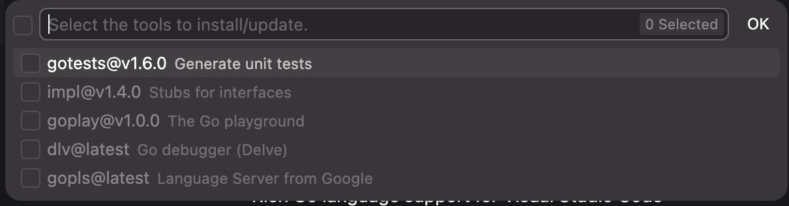
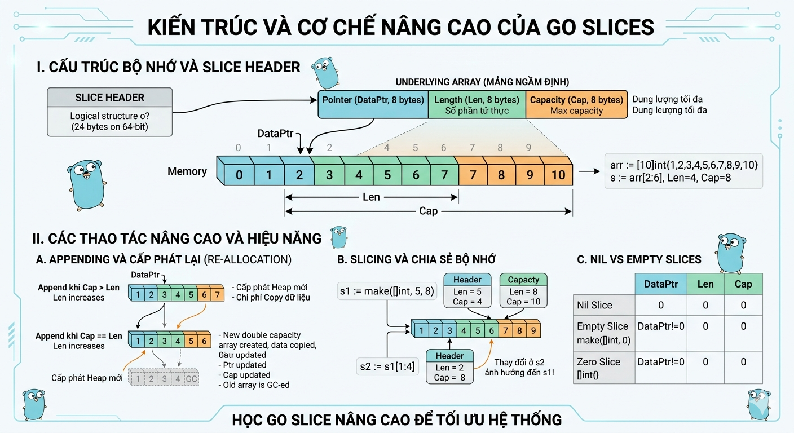
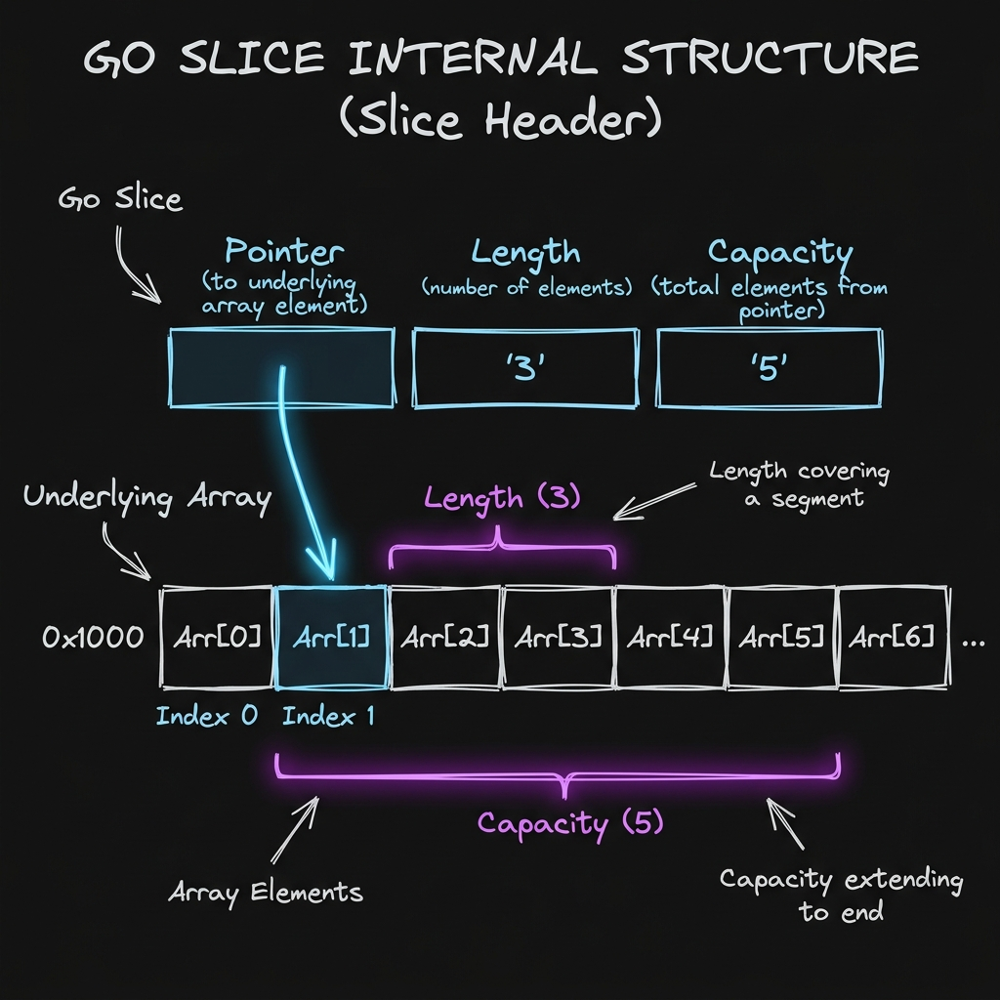
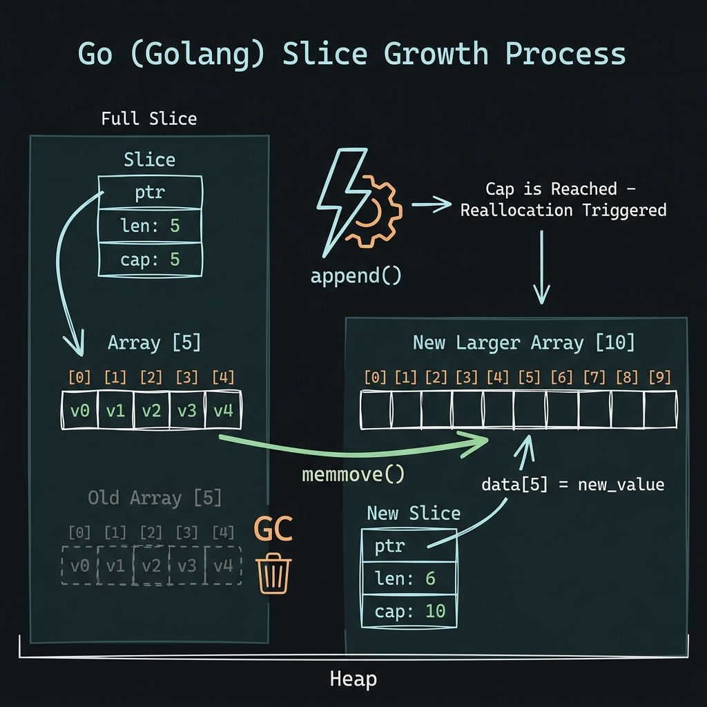

# 🌐 Go (Golang) Central Wiki & Learning Hub 🚀

Chào mừng bạn đến với Wiki học tập và nghiên cứu Go (Golang) dành cho các lập trình viên (đặc biệt phù hợp cho những ai có nền tảng từ Node.js/TypeScript chuyển sang). Đây là một kho tri thức toàn diện, liên kết chặt chẽ từ cú pháp cơ bản đến các cơ chế xử lý song song ở cấp độ sâu dưới mui xe (Under the Hood), cùng với thực hành và so sánh các framework phổ biến.

---

## 🗺️ Bản Đồ Wiki & Hệ Sinh Thái Học Tập (Wiki Navigation Hub)

|                  Trang Chủ                  |                So Sánh Core                 |                              So Sánh Framework                              |                      Kỹ Thuật Nâng Cao                       |                 Lộ Trình Thực Hành                  |
| :-----------------------------------------: | :-----------------------------------------: | :-------------------------------------------------------------------------: | :----------------------------------------------------------: | :-------------------------------------------------: |
| 🏠 **[Trang Chủ (Wiki Root)](./README.md)** | 📊 **[Go vs Node.js Core](./GO_NODEJS.md)** | 🚀 **[Echo vs Gin vs NestJS vs Express](./framework-comparison/README.md)** | 🛠️ **[14 Kỹ Thuật Go Luyện Tập](./go-techniques/README.md)** | 🎯 **[20 Bài Tập Tự Luyện](./exercises/README.md)** |

---

## 📂 Tổng Quan Cấu Trúc Hệ Thống Tài Liệu (Directory Map)

Hệ thống tài liệu này được cấu trúc hóa để bạn dễ dàng tra cứu, học tập và tái tạo (replicate) mã nguồn:

1. 🏠 **[Tài liệu Cú pháp & Concurrency Cơ bản (Trang Chủ)](./README.md)**: Chứa toàn bộ ghi chú học tập về kiểu dữ liệu, vòng lặp, struct, interface, goroutines, channels, context, `defer`/`panic`/`recover` và cơ chế **GMP Scheduler (GMP Model)** của Go.
2. 📊 **[Phân Tích Chuyên Sâu Go vs Node.js Core](./GO_NODEJS.md)**: Đi sâu so sánh JIT vs AOT compilation, luồng Event Loop vs Goroutines, bộ dọn rác GC tối ưu độ trễ thấp vs thông lượng cao, cùng kích thước đóng gói Docker.
3. 🚀 **[So Sánh Toàn Diện Framework HTTP](./framework-comparison/README.md)**: So sánh chi tiết **Echo vs Gin vs Express.js vs NestJS** về:
   - _Vòng đời Request (Request Lifecycle)_, _Kiến trúc & Cấu trúc dự án_, _DI / IoC_, _Validation & Transformation_, _Interceptors_, _Microservices & Sockets_ (NATS, gRPC, WebSockets).
   - Đính kèm mã nguồn hoàn chỉnh có khả năng chạy thử ngay lập tức (cho phép sao chép & nhân bản dễ dàng).
4. 🎯 **[Lộ Trình 20 Bài Tập Thực Hành Tự Luyện](./exercises/README.md)**: Lộ trình 5 cấp độ (từ Foundations đến Senior Concurrency, Redis Lua script, Gorilla WebSocket room hub, Batch processing pipeline). Mỗi bài tập đều đi kèm file giải mẫu bằng cả **Go** và **TypeScript/Node.js** giúp bạn so sánh trực quan nhất!

---

## 💻 Hướng Dẫn Chạy & Nhân Bản Mã Nguồn (How to Replicate & Run)

Tất cả các ví dụ code trong Wiki này đều được thiết kế hoàn chỉnh và cho phép chạy thử ngay lập tức.

### A. Chạy thử các Framework HTTP (Echo, Gin, Express, NestJS)

Mã nguồn đầy đủ của các framework nằm trong thư mục [framework-comparison/](./framework-comparison/):

- **Echo**:
   ```bash
   cd framework-comparison/echo-app && go run main.go
   ```
   _(Server lắng nghe trên cổng `8080`)_
- **Gin**:
   ```bash
   cd framework-comparison/gin-app && go run main.go
   ```
   _(Server lắng nghe trên cổng `8081`)_
- **Express.js (Node.js)**:
   ```bash
   cd framework-comparison/express-app && npm install && node app.js
   ```
   _(Server lắng nghe trên cổng `8082`)_
- **NestJS (TypeScript)**:
   ```bash
   cd framework-comparison/nest-app && npm install && npm run start
   ```
   _(Server lắng nghe trên cổng `8083`)_

### B. Chạy thử 20 Bài Tập Tự Luyện

Tất cả các bài tập nằm trong thư mục [exercises/](./exercises/) theo từng phân mục cụ thể. Ví dụ để chạy bài tập 01 (Struct & Methods):

- **Go**:
   ```bash
   cd exercises/level-1-foundations/ex01-struct-methods && go run struct_method.go
   ```
- **TypeScript**:
   ```bash
   cd exercises/level-1-foundations/ex01-struct-methods && npx ts-node ex01-struct-methods.ts
   ```

---

## 📑 Mục lục Chi Tiết Trang Chủ

- [🏁 1. Giới thiệu về Go](#-1-giới-thiệu-về-go)
- [🛠 2. Tooling \& Workspace](#-2-tooling--workspace)
- [📜 3. Cú pháp cơ bản (Basic Syntax)](#-3-cú-pháp-cơ-bản-basic-syntax)
- [⚙️ 4. Control Flow](#️-4-control-flow)
- [📦 5. Data Structures](#-5-data-structures)
- [🧬 6. Concurrency (Goroutines \& Channels)](#-6-concurrency-goroutines--channels)
- [🛡️ 7. Context (Quản lý vòng đời và Cancellation)](#-7-context-quản-lý-vòng-đời-và-cancellation)
- [8. Các từ khóa đặc biệt (`defer`, `panic`, `recover`)](#8-các-từ-khóa-đặc-biệt-defer-panic-recover)
- [⚠️ 9. Xử lý lỗi (Error Handling)](#-9-xử-lý-lỗi-error-handling)
- [🔗 10. So sánh Go với Node.js (Cho Developer)](#-10-so-sánh-go-với-nodejs-cho-developer)
- [❓ 11. Q\&A Quan trọng](#-11-qa-quan-trọng)

---

## 🏁 1. Giới thiệu về Go

Go là ngôn ngữ lập trình mã nguồn mở được phát triển bởi Google. Nó được thiết kế để kết hợp hiệu năng của C/C++ với sự đơn giản và năng suất của các ngôn ngữ như Python/JavaScript.

### Đặc điểm cốt lõi:

- **Tĩnh & Mạnh (Static & Strong Type):** Bắt lỗi ngay lúc biên dịch.
- **Biên dịch (Compiled):** Chạy trực tiếp trên mã máy, không cần máy ảo (giống C++, khác Java/Node.js).
- **Đồng thời (Concurrency):** Hỗ trợ hàng triệu luồng đồng thời (Goroutines) cực kỳ nhẹ.
- **Đơn giản:** Chỉ có 25 từ khóa, không có lớp (class), không kế thừa phức tạp.
- **Hệ sinh thái Cloud-Native:** Là ngôn ngữ của Docker, Kubernetes, Terraform.

Bonus:

- process-oriented
- `duck typing` được thể hiện qua
   - `functions`,
   - `methods`,
   - `interfaces`,
- Mô hình `concurrent programming` và `error handling` cũng được giới thiệu sơ qua

---

## 🛠 2. Tooling & Workspace



### Lệnh cơ bản

| Lệnh                 | Ý nghĩa                              |
| :------------------- | :----------------------------------- |
| `go run .`           | Biên dịch và chạy package hiện tại   |
| `go build`           | Xây dựng file thực thi (binary)      |
| `go mod init <name>` | Khởi tạo module mới                  |
| `go mod tidy`        | Dọn dẹp phụ thuộc (thêm/xóa package) |
| `go test ./...`      | Chạy toàn bộ test trong project      |
| `gofmt -w .`         | Tự động định dạng lại toàn bộ code   |

#### Quy tắc & Cú pháp quan trọng

- **Package main**: Mọi chương trình chạy được phải bắt đầu bằng `package main`.
- **Hàm main()**: Là điểm bắt đầu (entry point) của chương trình.
- **Dấu chấm phẩy (;)**: Go tự động thêm `;` khi biên dịch. Bạn **không nên** viết thủ công vào cuối dòng code.

### Cấu trúc Project khuyến nghị

```text
myapp/
├── go.mod        # Quản lý dependencies
├── main.go       # Entry point
├── internal/     # Code private, không cho package ngoài import
├── pkg/          # Code public, có thể tái sử dụng
└── cmd/          # Chứa các file thực thi khác nhau (Server, CLI...)
```

---

## 📜 3. Cú pháp cơ bản (Basic Syntax)

### 3. Khai báo Biến (Variables)

#### Các cách khai báo chính

Go hỗ trợ khai báo linh hoạt tùy vào phạm vi sử dụng.

- **Dùng từ khóa `var`:** Có thể dùng ở cả cấp độ package và function.
- **Sử dụng `:=` (Short declaration):** Chỉ dùng **trong hàm**. Loại này tự động nhận diện kiểu dữ liệu.

```go
var student1 string = "John" // Khai báo có kiểu
var student2 = "Jane"        // Tự động nhận diện kiểu
x := 2                       // Cách ngắn gọn (chỉ trong hàm)
```

#### Khai báo không khởi tạo (Zero Values)

Nếu không gán giá trị ngay, Go sẽ tự động gán giá trị mặc định cho biến:

- `int`: `0`
- `float32/64`: `0.0`
- `string`: `""`
- `bool`: `false`
- `pointer/interface/slice/map/channel`: `nil`

#### So sánh `var` và `:=`

| Đặc điểm      | `var`                                | `:=`                               |
| :------------ | :----------------------------------- | :--------------------------------- |
| **Phạm vi**   | 🌍 Trong & Ngoài hàm (Package level) | 🏠 Chỉ **Trong** hàm (Local level) |
| **Tách biệt** | ✅ Có thể khai báo trước, gán sau    | ❌ Phải khai báo và gán cùng lúc   |
| **Cú pháp**   | `var name type = val`                | `name := val`                      |

> [!TIP]
> Trong thực tế, hãy ưu tiên dùng `:=` bên trong hàm để code ngắn gọn. Chỉ dùng `var` khi cần khai báo biến toàn cục (package level) hoặc khi chưa biết giá trị khởi tạo ngay lập tức.

#### Khai báo nhiều biến

```go
// Trên cùng 1 dòng
var a, b, c, d int = 1, 3, 5, 7
var e, f = 6, "Hello" // Khác kiểu nếu không chỉ định type
g, h := 7, "World"

// Khai báo theo khối (Group block) - Tăng tính thẩm mỹ
var (
    userID   int
    userName string = "Guest"
    isActive bool   = true
)
```

> [!NOTE]
> Sử dụng khối `var (...)` giúp nhóm các biến có liên quan lại với nhau, giúp code sạch sẽ và dễ quản lý hơn.

#### Quy tắc đặt tên biến (Naming Rules)

- Phải bắt đầu bằng chữ cái hoặc dấu gạch dưới `_`.
- Không được bắt đầu bằng số.
- Chỉ chứa chữ cái, số và `_`.
- **Case-sensitive:** `age` và `Age` là hai biến khác nhau.
- Không chứa khoảng trắng và không trùng từ khóa Go.

**Conventions:**

- **Camel Case:** `myVariableName` (Dùng cho biến local).
- **Pascal Case:** `MyVariableName` (Dùng để **Export** biến ra ngoài package).
- **Snake Case:** `my_variable_name` (Ít dùng trong Go).

> [!IMPORTANT]
>
> ### 🔐 Cơ chế Quản lý Truy cập (Access Control)
>
> Trong Go, không có từ khóa `public`, `private` hay `protected`. Quyền truy cập được quyết định hoàn toàn bằng **chữ cái đầu tiên** của tên định danh:
>
> 1. **Exported (Công khai):** Bắt đầu bằng **CHỮ HOA**. Có thể được truy cập từ bất kỳ package nào khác.
>    - Ví dụ: `fmt.Println`, `http.ListenAndServe`, `Element.Value`.
> 2. **Unexported (Nội bộ):** Bắt đầu bằng **chữ thường**. Chỉ có thể truy cập bên trong package khai báo nó.
>    - Ví dụ: `Element.next`, `List.lazyInit`.
>
> **💡 Tại sao điều này quan trọng?**
> Khi viết thư viện (ví dụ: Linked List), nếu bạn để tên trường struct là chữ thường (`value`), người dùng cài đặt thư viện của bạn sẽ **không thể đọc hoặc gán giá trị** cho trường đó từ package `main` của họ.

#### Hằng số (Constants) & Iota

Hằng số là các giá trị không đổi sau khi khai báo. `iota` giúp tạo các số tăng dần tự động.

```go
const Pi = 3.14
const (
    Read = 1 << iota  // 1 (1 << 0)
    Write             // 2 (1 << 1)
    Execute           // 4 (1 << 2)
)
```

> [!NOTE]
> **Lưu ý về Hằng số:**
>
> - Hằng số phải được gán giá trị ngay khi khai báo.
> - Không thể dùng cú pháp `:=` cho hằng số.
> - `iota` sẽ tự động reset về 0 ở mỗi khối `const (...)` mới.

#### Hàm Xuất dữ liệu (Output Functions)

Sử dụng package `fmt` để in dữ liệu ra màn hình:

- **`Print()`**: In các đối mục sát nhau. Không tự thêm dòng mới.
- **`Println()`**: Thêm dấu cách giữa các đối mục và tự động xuống dòng (`\n`).
- **`Printf()`**: In định dạng (Format) bằng các **Verbs**:
   - `%v`: Giá trị mặc định.
   - `%T`: Kiểu dữ liệu của biến.
   - `%d`: Số nguyên (decimal).
   - `%s`: Chuỗi (string).
   - `%f`: Số thực (float). Ví dụ `%.2f` lấy 2 chữ số thập phân.
   - `%t`: Boolean (true/false).

#### Hệ thống Toán tử (Operators)

| Loại        | Toán tử                                                     |
| :---------- | :---------------------------------------------------------- | ------------------ | ------ |
| **Số học**  | `+`, `-`, `*`, `/`, `%`, `++`, `--`                         |
| **Gán**     | `=`, `+=`, `-=`, `*=`, `/=`, `%=`, `&=`, `^=`, `<<=`, `>>=` |
| **So sánh** | `==`, `!=`, `<`, `>`, `<=`, `>=`                            |
| **Logic**   | `&&`, `                                                     |                    | `, `!` |
| **Bitwise** | `&`, `                                                      | `, `^`, `<<`, `>>` |

### Kiểu dữ liệu cơ bản

- **Số nguyên:** `int`, `int8`, `int64`, `uint`, `byte` (alias của `uint8`).
- **Số thực:** `float32`, `float64`.
- **Logic:** `bool`.
- **Chuỗi:** `string` (immutable UTF-8).
- **Ký tự:** `rune` (alias của `int32`, đại diện cho 1 Unicode code point).

---

## ⚙️ 4. Control Flow

### If / Else

Có thể khai báo biến tạm ngay trong `if`.

```go
if v := compute(); v > 10 {
    fmt.Println(v)
} else {
    fmt.Println("Small")
}
```

### Loops (Chỉ có `for`)

Go không có `while` hay `do-while`.

```go
// 1. Vòng lặp cơ bản
for i := 0; i < 5; i++ {
    fmt.Println(i)
}

// 2. Vòng lặp dạng while
i := 1
for i < 5 {
    i *= 2
}

// 3. Lặp qua Arrays/Slices/Maps (Range)
for index, value := range fruits {
    fmt.Printf("Vị trí %d là %s\n", index, value)
}
```

> [!TIP]
> **Lưu ý về Range:**
>
> - Nếu bạn không cần `index`, hãy dùng dấu gạch dưới `_`: `for _, value := range fruits`.
> - Range tạo ra một **bản sao (copy)** của phần tử, không phải chính phần tử đó.

### Switch

Không cần lệnh `break` (Go tự động dừng). Hỗ trợ **Multi-case** (nhiều giá trị trong 1 case).

```go
switch day {
case "Sat", "Sun":
    fmt.Println("Weekend") // Chạy cho cả 2 trường hợp
case "Mon":
    fmt.Println("Start work")
default:
    fmt.Println("Working...")
}
```

---

## 📦 5. Data Structures

### Arrays & Slices



| Đặc điểm              | Array (Mảng)                                                        | Slice (Lát cắt)                                            |
| :-------------------- | :------------------------------------------------------------------ | :--------------------------------------------------------- |
| Kích thước            | Cố định khi khai báo.                                               | "Linh hoạt, có thể co giãn."                               |
| Kiểu dữ liệu          | Kích thước là một phần của kiểu dữ liệu (ví dụ [3]int khác [5]int). | Không chứa kích thước trong kiểu dữ liệu (ví dụ []int).    |
| Vùng nhớ              | Lưu trữ giá trị trực tiếp.                                          | Lưu tham chiếu đến một Array ngầm định (Underlying Array). |
| Cách truyền (Pass by) | Truyền giá trị (copy toàn bộ mảng).                                 | Truyền tham chiếu (chỉ copy cấu trúc Slice Header).        |
| Tính phổ biến         | Ít dùng trực tiếp trong logic nghiệp vụ.                            | Sử dụng thường xuyên trong hầu hết mọi trường hợp.         |

- **Array:** Kích thước cố định. `var a [3]int = [3]int{1, 2, 3}`.
   - Fixed length
   - Same type
   - Indexable
   - Contigous in Mem
- **Slice:** Linh hoạt hơn, là "view" của một array.
 <!-- Bạn có muốn tìm hiểu về cách dùng Pointer to Slice (ví dụ *[]int) và tại sao trong 99% trường hợp chúng ta không bao giờ nên dùng nó không? -->

```go
// Tạo slice bằng make
s := make([]int, 5, 10) // len=5, cap=10

// Khởi tạo nhanh
fruits := []string{"apple", "orange"}

// Cắt slice từ array
arr := [5]int{1, 2, 3, 4, 5}
s1 := arr[1:3] // [2, 3]

// Copy slice
dst := make([]int, len(s1))
copy(dst, s1)
```

> [!IMPORTANT]
> **Lưu ý về Slice:**
>
> - Slice là một **reference type**. Khi bạn gán `s1 = s2`, cả hai cùng trỏ vào một vùng nhớ.
> - Nếu bạn thay đổi phần tử trong slice được cắt từ array, array gốc cũng bị thay đổi theo.
> - Dùng `cap()` để kiểm tra sức chứa tối đa trước khi Go phải cấp phát lại bộ nhớ mới.

#### 🧠 Cấu trúc chuyên sâu: Slice Header

Bản chất của Slice không chứa dữ liệu, nó là một cấu trúc dữ liệu nhỏ (Slice Header) gồm 3 trường:

1. **Pointer**: Trỏ đến vị trí bắt đầu của slice trong mảng ngầm định (Underlying Array).
2. **Length**: Số lượng phần tử hiện có trong slice.
3. **Capacity**: Số lượng phần tử tối đa mà slice có thể chứa tính từ vị trí Pointer.



> [!TIP]
> Khi `append` vượt quá `capacity`, Go sẽ cấp phát một mảng mới có kích thước gấp đôi (nếu mảng nhỏ) và copy dữ liệu sang. Đây là lý do tại sao ta nên khai báo `make([]T, len, cap)` nếu biết trước kích thước để tối ưu hiệu năng.

---

### 🚀 Phân tích chuyên sâu: Cơ chế Append & Reallocation

Ở cấp độ chuyên sâu, việc `append` vượt quá `capacity` không chỉ đơn thuần là "copy dữ liệu", mà nó là một chuỗi các thao tác tốn kém liên quan đến bộ nhớ (Memory Management) và trình điều phối (Scheduler) của Go.



Dưới đây là phân tích chi tiết những gì xảy ra bên trong Go Runtime khi hiện tượng này xảy ra:

#### 1. Cơ chế tính toán "New Capacity" (Growth Algorithm)

Go không luôn luôn nhân đôi kích thước mảng. Từ phiên bản **Go 1.18+**, thuật toán tăng trưởng đã thay đổi để mượt mà hơn, tránh lãng phí bộ nhớ khi mảng trở nên quá lớn:

- **Nếu $cap < 256$:** Go sẽ nhân đôi ($2x$) dung lượng.
- **Nếu $cap \ge 256$:** Thay vì nhân đôi, Go áp dụng công thức:
  $$newcap = oldcap + (oldcap + 3 \times 256) / 4$$
  Cách này giúp tốc độ tăng trưởng giảm dần từ $2x$ xuống khoảng $1.25x$ khi mảng lớn dần lên.

#### 2. Quy trình "Allocation & Copy" dưới nắp capo

Khi một lệnh `append` gây ra việc vượt ngưỡng (overflow) dung lượng, Go Runtime thực hiện các bước sau:

1. **Cấp phát Heap mới (`mallocgc`):** Go sẽ tìm một vùng nhớ mới trên **Heap**. Đây là một thao tác đắt đỏ vì nó liên quan đến việc tìm kiếm các "free spans" trong bộ nhớ.
2. **Memory Alignment (Căn chỉnh bộ nhớ):** Sau khi tính được `newcap`, Go sẽ làm tròn con số này lên để khớp với các "size classes" của bộ nhớ. Ví dụ: Bạn cần 100 bytes, nhưng Go có thể cấp phát 112 bytes để tối ưu hóa việc quản lý. Do đó, `cap` thực tế sau khi `append` thường lớn hơn con số dự tính một chút.
3. **Hàm `memmove`:** Đây là giai đoạn copy. Go sử dụng hàm `runtime.memmove` (thường được viết bằng hợp ngữ - Assembly để đạt tốc độ tối đa) để copy dữ liệu từ mảng cũ sang mảng mới. Mặc dù rất nhanh, nhưng với mảng hàng triệu phần tử, nó vẫn gây ra độ trễ CPU đáng kể.
4. **Hủy mảng cũ (GC Pressure):** Mảng cũ bây giờ không còn ai trỏ tới. Nó trở thành "rác". Garbage Collector sẽ phải tốn thêm chu kỳ CPU để quét và giải phóng vùng nhớ này sau đó.

#### 3. Tại sao `make([]T, len, cap)` lại tối ưu vượt trội?

Khi bạn sử dụng `make` với dung lượng dự tính trước, bạn đang thực hiện chiến thuật **"Single Allocation"**:

- **Tránh "Memory Fragmentation":** Việc cấp phát - giải phóng liên tục (khi mảng lớn dần) sẽ làm bộ nhớ bị phân mảnh. `make` giúp giữ bộ nhớ liền mạch.
- **Loại bỏ `memmove`:** Không có dữ liệu nào phải copy đi copy lại nhiều lần.
- **Giảm tải cho Garbage Collector:** Thay vì tạo ra 5-10 mảng trung gian (rác) trong quá trình tăng trưởng, bạn chỉ tạo ra đúng 1 đối tượng duy nhất.

#### 4. Phân tích hiệu năng (Benchmark thực tế)

Hãy nhìn vào sự khác biệt khi xử lý 1 triệu phần tử:

- **Iterative Append (không `make`):** Có thể xảy ra khoảng 20-25 lần cấp phát lại (re-allocation), tốn hàng chục ms cho việc copy và dọn rác.
- **Pre-allocated Make:** Chỉ có **1 lần** cấp phát duy nhất. Tốc độ nhanh hơn gấp 2-5 lần và lượng RAM tiêu thụ ổn định tuyệt đối.

#### 5. Lời khuyên cho Senior

Trong các hệ thống Backend đòi hỏi độ trễ thấp (Low Latency):

1. **Dự đoán kích thước:** Nếu fetch dữ liệu từ Database hoặc Proxmox, hãy dùng `COUNT` trước hoặc ước lượng một con số trung bình để `make`.
2. **Slicing từ mảng lớn:** Nếu bạn cần lọc dữ liệu, thay vì `append` vào slice mới, hãy cân nhắc thao tác ngay trên slice cũ bằng cách thay đổi index để tránh cấp phát thêm.
3. **Thận trọng với mảng lớn:** Nếu slice quá lớn (vài trăm MB), việc `append` gây nhân đôi dung lượng có thể dẫn đến lỗi `out of memory` đột ngột dù bạn nghĩ mình vẫn còn dư RAM.

---

### String

Về mặt kỹ thuật, một string trong Go là một Header cực kỳ nhỏ gọn, bao gồm hai trường:

- **Data Pointer:** Con trỏ trỏ đến mảng byte ngầm định (Underlying byte array).
- **Len:** Độ dài của chuỗi (tính theo số lượng byte).

- **Immutability (Bất biến):** Dữ liệu mà con trỏ trỏ tới là không thể thay đổi. Mọi thao tác "sửa" chuỗi thực tế là tạo ra một Header mới trỏ đến một vùng nhớ mới.

- **Zero-copy Slicing:** Khi bạn thực hiện `s2 := s1[1:5]`, Go không copy dữ liệu. `s2` chỉ là một Header mới trỏ vào giữa mảng byte của `s1`. Điều này cực kỳ hiệu quả về mặt hiệu năng nhưng có thể gây "memory leak" nếu bạn giữ một slice nhỏ từ một string khổng lồ.

### UTF-8, Rune và Byte

| Khái niệm | Kiểu dữ liệu | Giải thích                                                                        |
| --------- | ------------ | --------------------------------------------------------------------------------- |
| Byte      | uint8        | Đơn vị lưu trữ cơ bản. Ký tự ASCII chiếm 1 byte, ký tự Unicode chiếm 2-4 bytes."  |
| Rune      | int32        | "Đại diện cho một Unicode Code Point. Một "chữ" chúng ta đọc được."               |
| String    | string       | "Một dãy các byte (không nhất thiết phải là UTF-8 hợp lệ, nhưng mặc định là vậy). |

---

### Maps (Key-Value)

```go
m := make(map[string]int)
m["gold"] = 100
delete(m, "gold")      // Xóa phần tử theo key
val, ok := m["gold"]   // ok = false nếu không tìm thấy
```

### Structs (Thay thế Class)

```go
type Person struct {
    name   string
    age    int
    job    string
    salary int
}

// Khởi tạo
var p1 Person
p1.name = "John" // Gán giá trị sau khi khai báo

p2 := Person{name: "Jane", age: 25} // Khởi tạo nhanh
```

### Methods (Hàm dành riêng cho Struct)

Methods không thuộc về Struct nhưng "gắn" vào nó thông qua **receiver**.

```go
func (p Person) Describe() {
    fmt.Printf("%s is %d years old\n", p.name, p.age)
}
```

> [!IMPORTANT]
> **Lưu ý về Struct & Methods:**
>
> - **Pointer Receiver:** Nếu muốn thay đổi giá trị của struct bên trong method, bạn phải dùng con trỏ: `func (p *Person) UpdateAge(newAge int)`.
> - **Value Receiver:** Nếu dùng `(p Person)`, Go sẽ copy toàn bộ struct vào hàm, mọi thay đổi bên trong sẽ không ảnh hưởng gốc.

---

## 🧬 6. Concurrency (Goroutines & Channels)

Đây là "vũ khí" mạnh nhất của Go, giúp nó xử lý hàng triệu kết nối đồng thời với tài nguyên cực thấp.

### ⚔️ So sánh Thread (Hệ điều hành) vs Goroutines (Go Runtime)

| Đặc điểm             | OS Thread                                                           | Goroutines                                                      |
| :------------------- | :------------------------------------------------------------------ | :-------------------------------------------------------------- |
| **Quản lý**          | Bởi Hệ điều hành (OS), phụ thuộc số nhân CPU vật lý.                | Bởi **Go Runtime**, không phụ thuộc số nhân CPU.                |
| **Kích thước Stack** | Cố định (thường 1-2MB). Dễ gây lãng phí bộ nhớ.                     | Linh hoạt (khởi đầu 2KB). Có thể tăng/giảm động.                |
| **Stack Growth**     | Cấp phát lúc biên dịch, không thể tăng thêm (dễ bị Stack Overflow). | Có thể tăng lên đến **1GB** trên hệ thống 64-bit.               |
| **Giao tiếp**        | Khó khăn, độ trễ lớn (thường dùng Shared Memory + Lock).            | Dễ dàng qua **Channels** với độ trễ cực thấp.                   |
| **Định danh**        | Có ID cụ thể (TID) trong process.                                   | Không có ID công khai (để tránh lạm dụng Thread Local Storage). |
| **Lifecycle**        | Khởi tạo và giải phóng tốn nhiều thời gian/CPU.                     | Go Runtime quản lý việc tạo/xóa cực kỳ nhanh chóng.             |
| **Context Switch**   | Chi phí lớn do OS phải can thiệp (Save/Restore Registers).          | Chi phí cực thấp do Go Runtime tự điều phối (M:N scheduling).   |

### ⚙️ Đi sâu cơ chế M:N Scheduling & Mô hình GMP (Go Scheduler)

Để đạt được hiệu năng vượt trội, Go không ánh xạ trực tiếp `1 Goroutine` vào `1 OS Thread` (tỷ lệ 1:1) mà sử dụng cơ chế điều phối **M:N** (M Goroutines chạy trên N OS Threads logic) thông qua mô hình **GMP**:

```
                  ┌──────────────┐
                  │ Global Queue │
                  └──────┬───────┘
                         │
                         ▼
                  ┌──────────────┐
                  │   OS Thread  │ (M)
                  └──────┬───────┘
                         │ (quản lý / thực thi)
                         ▼
                  ┌──────────────┐
                  │  Processor   │ (P) ──[ Local Run Queue: G1 ➔ G2 ➔ G3 ]
                  └──────┬───────┘
                         │ (đang chạy)
                         ▼
                  ┌──────────────┐
                  │  Goroutine   │ (G)
                  └──────┬───────┘
```

- **G (Goroutine):** Đại diện cho một luồng thực thi phía User-space. Nó chứa stack riêng (khởi đầu chỉ 2KB), Program Counter và các thông tin trạng thái để lên lịch.
- **M (Machine / OS Thread):** Thực thể vật lý duy nhất thực thi mã máy trên CPU, do Hệ điều hành quản lý.
- **P (Processor / Bộ điều phối logic):** Đại diện cho tài nguyên cần thiết để chạy mã Go. Số lượng `P` cố định bằng số nhân CPU vật lý (`GOMAXPROCS`). Mỗi `P` quản lý một **Local Run Queue** chứa các Goroutine đang chờ được chạy.

#### 3 Thuật toán cốt lõi làm nên sức mạnh của GMP:

1. **Work Stealing (Trộm việc):**
   Khi một Thread `M` chạy hết tác vụ trong hàng đợi cục bộ của `P` đi kèm, thay vì đi ngủ (gây tốn chi phí Context Switch của OS), nó sẽ chủ động sang các `P` khác để **"trộm" lại 50% số lượng Goroutine** đang xếp hàng để xử lý phụ.
2. **Hand-Off (Chuyển giao) khi gặp Blocking Syscall:**
   Khi một Goroutine `G` thực hiện gọi một System Call đồng bộ (như đọc file từ đĩa cứng hoặc truy vấn DNS), OS Thread `M` chứa nó sẽ bị block.
   - _Giải pháp:_ Go Runtime ngay lập tức ngắt liên kết giữa `P` và `M`. `P` sẽ được chuyển giao sang một Thread `M` rảnh khác để tiếp tục chạy các Goroutine còn lại. Khi tác vụ I/O của `M` cũ xong, `G` đó sẽ được nạp lại vào một hàng đợi `P` bất kỳ.
3. **Netpoller (Asynchronous Network I/O):**
   Đối với I/O mạng, Go không dùng cơ chế chặn đồng bộ. Khi `G` thực hiện I/O mạng, nó sẽ được chuyển vào quản lý bởi **Netpoller** (dựa trên `epoll` của Linux hoặc `kqueue` của macOS) để ngủ.
   - OS Thread `M` hoàn toàn không bị block và có thể lấy ngay một `G` khác để chạy. Khi gói tin mạng trả về, Netpoller sẽ đánh thức `G` dậy và chuyển về lại hàng đợi `P`.
4. **Asynchronous Preemption (Trưng dụng phi hợp tác):**
   Từ Go 1.14, Go Runtime áp dụng cơ chế trưng dụng bằng cách định kỳ gửi tín hiệu OS (`SIGURG`) tới các thread đang chạy. Nếu phát hiện một `G` chiếm dụng luồng liên tục quá **10ms** (ví dụ vòng lặp vô hạn), Go sẽ cưỡng chế dừng `G` lại, đẩy về hàng đợi để nhường sân cho các `G` khác.

### Cách sử dụng cơ bản

- **Goroutine:** Dùng từ khóa `go` trước một hàm để chạy song song.
- **Channel:** Dùng để giao tiếp giữa các goroutines (**"Don't communicate by sharing memory; share memory by communicating"**).

```go
ch := make(chan string)
go func() {
    ch <- "Done" // Gửi dữ liệu vào channel
}()
msg := <-ch     // Nhận dữ liệu (Blocking cho đến khi có tin nhắn)
fmt.Println(msg)
```

---

## 🛡️ 7. Context (Quản lý vòng đời và Cancellation)

`context` là một package cực kỳ quan trọng trong Go, được dùng để quản lý thời gian sống (lifecycle), hủy bỏ (cancellation) và truyền dữ liệu (metadata) xuyên suốt các lời gọi hàm và API.

**Các trường hợp sử dụng chính:**

- **Cancellation:** Hủy các goroutines đang chạy khi không còn cần thiết (ví dụ: người dùng đóng trình duyệt).
- **Timeout/Deadline:** Giới hạn thời gian chạy của một tác vụ để tránh treo hệ thống.
- **Metadata:** Truyền dữ liệu như RequestID, Auth Token xuyên suốt các lớp xử lý.

**Ví dụ về Timeout:**

```go
func main() {
    // Tạo context với timeout 2 giây
    ctx, cancel := context.WithTimeout(context.Background(), 2*time.Second)

    // Quan trọng: Luôn gọi cancel để giải phóng tài nguyên ngay khi xong việc
    defer cancel()

    select {
    case <-time.After(3 * time.Second):
        fmt.Println("Tác vụ hoàn thành sau 3s")
    case <-ctx.Done():
        // Nếu quá 2s mà chưa xong, case này sẽ chạy
        fmt.Println("Lỗi:", ctx.Err()) // Output: context deadline exceeded
    }
}
```

---

## 8. Các từ khóa đặc biệt (`defer`, `panic`, `recover`)

### Defer

Dùng để trì hoãn việc thực thi một hàm cho đến khi hàm bao quanh nó kết thúc (thường dùng để đóng file, kết nối DB).

```go
func main() {
    defer fmt.Println("Thế giới!")
    fmt.Println("Chào")
}
// Kết quả: Chào Thế giới!
```

> [!TIP]
> **Lưu ý về Defer:**
>
> - Nếu có nhiều lệnh `defer`, chúng sẽ chạy theo thứ tự **LIFO** (Last In, First Out) - lệnh nào khai báo sau cùng sẽ chạy trước.

### Panic & Recover

- `panic`: Dùng để dừng chương trình ngay lập tức khi gặp lỗi nghiêm trọng.
- `recover`: Dùng trong hàm `defer` để "cứu" chương trình khỏi bị crash sau khi `panic`.

---

## ⚠️ 9. Xử lý lỗi (Error Handling)

Go không dùng `try/catch`. Lỗi là một giá trị trả về.

```go
func doWork() (int, error) {
    if fail { return 0, errors.New("failed") }
    return 100, nil
}

// Cách dùng phổ biến
val, err := doWork()
if err != nil {
    log.Fatal(err)
}
```

---

## 🔗 10. So sánh Go với Node.js (Cho Developer)

Để xem chi tiết bản so sánh tư duy lập trình và báo cáo hiệu năng thực tế giữa Go và Node.js/TypeScript (Bun), vui lòng xem tài liệu riêng biệt:

👉 **[Báo cáo So sánh Go vs Node.js](./GO_NODEJS.md)**

---

# Xử lý đồng thời trong Golang

---

## ❓ 11. Q&A Quan trọng

### 1. Số thực (Float) được lưu thế nào?

Theo tiêu chuẩn **IEEE 754**. Ví dụ `float64` có 1 bit dấu, 11 bit mũ và 52 bit phần lẻ. Tránh dùng float cho tiền tệ vì sai số nhị phân.

### 2. Interface trong Go có gì đặc biệt?

Interface trong Go là **Implicit**. Một Struct không cần khai báo `implements Interface`. Chỉ cần nó có đủ các phương thức mà Interface yêu cầu, nó sẽ tự động được coi là implement Interface đó (Duck Typing).

---

_Tài liệu này được tổng hợp để hỗ trợ quá trình học tập. Hãy thực hành viết code thường xuyên để nắm vững kiến thức!_

ASCII

- use 7 bits bieu dien 128 ky tu

atomic unit
mutex

Viewed main.md:22-84

Đối với một nhà phát triển (developer) đang học và muốn làm chủ (master) ngôn ngữ Go (Golang), đặc biệt là hướng tới xây dựng các hệ thống backend chất lượng cao, chịu tải lớn (như hệ thống Indexer ta vừa phân tích), dưới đây là lộ trình chi tiết về **Cú pháp cốt lõi**, **Công nghệ bổ trợ** và **Thực hành thực tế** cần tập trung luyện tập:

---

### PHẦN 1: CÁC KHÁI NIỆM & CÚ PHÁP CỐT LÕI (Core Syntax)

Go là ngôn ngữ cực kỳ tối giản (chỉ có khoảng 25 từ khóa), nhưng để viết code hiệu quả và tối ưu hiệu năng, bạn cần hiểu sâu các khái niệm bên dưới lớp vỏ tối giản đó:

#### 1. Pointer vs. Value (Con trỏ & Tham trị)

- **Cần hiểu:** Cơ chế cấp phát bộ nhớ (Stack vs. Heap, Escape Analysis).
- **Khi nào dùng:**
   - Truyền con trỏ (`*T`) để sửa đổi trực tiếp dữ liệu hoặc tránh copy các struct lớn (tiết kiệm RAM).
   - Truyền tham trị (`T`) để đảm bảo dữ liệu là bất biến (immutable) và an toàn giữa các luồng.
- **Luyện tập:** Viết các phương thức (methods) với Value Receiver và Pointer Receiver để so sánh sự khác biệt.

#### 2. Slices & Maps (Cơ chế hoạt động bên dưới)

- **Cần hiểu:** Slice thực chất là một Header trỏ tới một _underlying array_. Khi slice vượt quá sức chứa (`capacity`), Go sẽ tự động cấp phát một array mới lớn gấp đôi và copy dữ liệu sang.
- **Tối ưu:** Luôn cấp phát trước dung lượng nếu biết trước kích thước bằng `make([]Type, 0, capacity)` để tránh cấp phát lại liên tục gây chậm hệ thống (gây áp lực lên Garbage Collector).
- **Luyện tập:** Sử dụng slice expressions, thao tác thêm/xóa phần tử trong slice/map một cách tối ưu.

#### 3. Concurrency (Lập trình song song): Goroutines & Channels

Đây là "vũ khí tối thượng" của Go.

- **Cần hiểu:**
   - **Goroutine:** Luồng siêu nhẹ (chỉ tốn khoảng 2KB RAM khởi điểm) chạy trên mô hình lập trình ghép kênh M:N của Go Runtime.
   - **Channels:** Cơ chế giao tiếp giữa các Goroutines theo triết lý: _"Don't communicate by sharing memory; share memory by communicating"_.
   - **Buffered vs. Unbuffered Channel:** Sự khác biệt về blocking behavior (khóa luồng).
   - **Select Statement:** Điều hướng dữ liệu từ nhiều channel đồng thời.
- **Luyện tập:** Viết mô hình **Worker Pool** (1 hàng đợi công việc, nhiều worker xử lý song song giống như cơ chế tải khối của `Poller`).

#### 4. Quản lý đồng bộ bộ nhớ (Mutex & Atomics)

- **Cần hiểu:** Khi nhiều Goroutines cùng đọc/ghi vào một biến hoặc vùng nhớ, bạn sẽ gặp lỗi **Race Condition**.
- **Công cụ:**
   - `sync.Mutex` và `sync.RWMutex` (Khóa đọc/ghi).
   - `sync/atomic` (Phép toán nguyên tử cấp CPU): Cực kỳ nhẹ và hiệu năng cao cho các biến số trạng thái (như biến `lastCommittedBlock atomic.Uint64` mà ta đã phân tích).
- **Luyện tập:** Sử dụng công cụ kiểm tra xung đột luồng của Go: `go test -race ./...`.

#### 5. Context (`context.Context`)

- **Cần hiểu:** Cách lan truyền tín hiệu hủy (cancellation), giới hạn thời gian (timeout) và truyền metadata xuyên suốt các tầng API/Database/Network.
- **Lưu ý:** Thiếu `context` hoặc xử lý sai sẽ dẫn đến rò rỉ Goroutine (Goroutine leak) khiến ứng dụng bị tràn RAM và sập sau một thời gian chạy.
- **Luyện tập:** Viết một tác vụ chạy nền dài hạn và áp dụng cơ chế **Graceful Shutdown** (dừng an toàn) bằng cách lắng nghe tín hiệu từ hệ điều hành (`SIGINT`/`SIGTERM`) kết hợp với `context.WithCancel`.

#### 6. Quản lý lỗi (Error Handling)

- **Cần hiểu:** Go không sử dụng `try/catch` mà coi lỗi là một giá trị trả về thường nhật (`error`).
- **Kỹ thuật:** Sử dụng `errors.Is()`, `errors.As()` để so sánh lỗi và `fmt.Errorf("... %w", err)` để bọc lỗi (error wrapping) giữ nguyên vết lỗi ban đầu.

---

### PHẦN 2: CÔNG NGHỆ BỔ TRỢ CẦN BIẾT (Tech Stack)

Để làm dự án thực tế, chỉ giỏi cú pháp Go là chưa đủ. Bạn cần luyện tập bộ công cụ (ecosystem) xung quanh:

1. **Hệ quản trị CSDL & SQL:**
   - Hiểu cách cấu hình **Connection Pool** (`MaxOpenConns`, `MaxIdleConns`, `ConnMaxLifetime`) thông qua thư viện `database/sql`. Việc cấu hình sai có thể bóp nghẹt hiệu năng của DB.
   - Biết cách quản lý transaction (`tx.Begin()`, `tx.Commit()`, `tx.Rollback()`) để đảm bảo tính toàn vẹn dữ liệu (ACID).
   - Quản lý cơ sở dữ liệu có phiên bản bằng công cụ Migration (như `golang-migrate`).
2. **gRPC và Protocol Buffers (Protobuf):**
   - Thay vì chỉ dùng REST API (JSON), các hệ thống backend hiệu năng cao ngày nay đa phần sử dụng **gRPC** để giao tiếp (giống như cách Indexer giao tiếp với MMN Node).
   - Luyện tập viết các file `.proto` và tự sinh code Go (`protoc-gen-go`).
3. **Structured Logging & Metrics:**
   - Bỏ thói quen dùng `fmt.Println` để debug trên Production. Thay vào đó hãy dùng các thư viện ghi log cấu trúc định dạng JSON (như `zerolog` hoặc `zap`).
   - Tích hợp **Prometheus** để đo đạc chỉ số hệ thống (số request/giây, thời gian xử lý database, RAM/CPU tiêu thụ).
4. **Unit Testing & Mocking:**
   - Go tích hợp sẵn bộ test rất mạnh (`go test`). Bạn cần học cách viết **Table-Driven Tests** (phương pháp chuẩn mực của cộng đồng Go).
   - Sử dụng công cụ sinh Mock (như `mockery`) để viết Unit Test cho tầng nghiệp vụ (Business Logic) mà không cần phụ thuộc vào cơ sở dữ liệu thật.

---

### LỘ TRÌNH THỰC HÀNH TỰ LUYỆN (Practice Roadmap)

Để tiến bộ nhanh nhất, bạn hãy tự tay xây dựng 3 bài tập thực tế sau từ dễ đến khó:

- **Bài tập 1: Multi-threaded Web Crawler (Cấp độ Cơ bản)**
   - _Yêu cầu:_ Viết một công cụ cào dữ liệu từ danh sách 100 trang web. Sử dụng Goroutines để tải dữ liệu song song. Sử dụng `sync.WaitGroup` hoặc Channel để đợi các luồng hoàn thành. Áp dụng `context.WithTimeout` để nếu trang nào tải quá 3 giây thì tự hủy.
- **Bài tập 2: REST & gRPC API dịch vụ Ví điện tử (Cấp độ Trung cấp)**
   - _Yêu cầu:_ Xây dựng dịch vụ API thực hiện chuyển tiền qua lại giữa các tài khoản. Viết Database Migration bằng Postgres. Sử dụng SQL Transaction để đảm bảo tiền trừ tài khoản A thì chắc chắn phải cộng vào tài khoản B. Viết Unit Test và dùng Mock để test logic chuyển tiền.
- **Bài tập 3: Pipeline xử lý dữ liệu thời gian thực (Cấp độ Nâng cao)**
   - _Yêu cầu:_ Giả lập một hệ thống giống như Indexer. Viết 1 Goroutine (Poller) liên tục sinh ra các bản ghi số liệu giả lập đẩy vào một mảng tạm (Staging). Viết Goroutine thứ 2 (Committer) định kỳ lấy dữ liệu từ mảng tạm đó, lọc các bản ghi trùng lặp và lưu vào Database chính. Tích hợp log cấu trúc và Prometheus để giám sát tốc độ xử lý dữ liệu.
