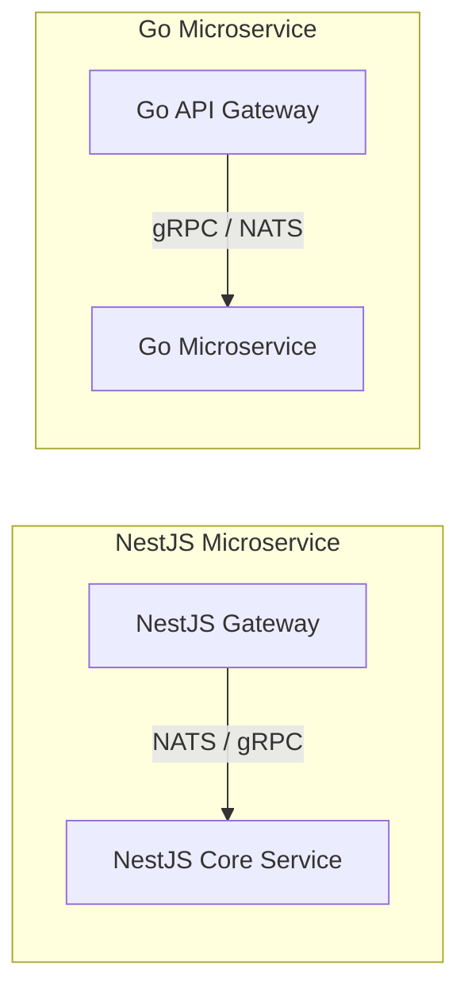

# 🚀 So Sánh Toàn Diện: Echo vs Gin vs Express.js vs NestJS

Tài liệu này cung cấp một bài phân tích chuyên sâu, so sánh chi tiết từ kiến trúc cốt lõi đến các tính năng nâng cao (Vòng đời request, Dependency Injection, Validation & Transformation, Microservices, WebSockets, Sockets, NATS...) giữa 4 framework phát triển Web/API phổ biến nhất hiện nay: **Echo** & **Gin** (Go) và **Express.js** & **NestJS** (Node.js/TypeScript).

---

## 🗺️ Bản Đồ Wiki & Hệ Sinh Thái Học Tập (Wiki Navigation Hub)

|                  Trang Chủ                   |                 So Sánh Core                 |                   So Sánh Framework                    |                       Kỹ Thuật Nâng Cao                       |                  Lộ Trình Thực Hành                  |
| :------------------------------------------: | :------------------------------------------: | :----------------------------------------------------: | :-----------------------------------------------------------: | :--------------------------------------------------: |
| 🏠 **[Trang Chủ (Wiki Root)](../README.md)** | 📊 **[Go vs Node.js Core](../GO_NODEJS.md)** | 🚀 **[Echo vs Gin vs NestJS vs Express](./README.md)** | 🛠️ **[14 Kỹ Thuật Go Luyện Tập](../go-techniques/README.md)** | 🎯 **[20 Bài Tập Tự Luyện](../exercises/README.md)** |

---

## 📖 Bảng Chú Thích Thuật Ngữ (Glossary)

| Viết tắt / Thuật ngữ       | Ý nghĩa                        | Giải thích                                                                                                     |
| :------------------------- | :----------------------------- | :------------------------------------------------------------------------------------------------------------- |
| **Request Lifecycle**      | Vòng đời Request               | Trình tự các bước thực thi từ khi máy chủ nhận được HTTP request cho đến khi gửi phản hồi về client.           |
| **DI / IoC Container**     | Container Đảo ngược Điều khiển | Bộ quản lý tự động vòng đời và sự phụ thuộc của các đối tượng (Đặc trưng của NestJS).                          |
| **Data Transformation**    | Biến đổi Dữ liệu               | Cơ chế chuyển đổi kiểu dữ liệu thô (chuỗi, số từ JSON) thành kiểu dữ liệu có định danh rõ ràng (Struct/Class). |
| **Response Serialization** | Tuần tự hóa Phản hồi           | Lọc và định dạng lại cấu trúc dữ liệu trước khi chuyển thành JSON gửi về client.                               |
| **NATS / Message Broker**  | Hệ thống Truyền tin nhắn       | Bộ trung chuyển tin nhắn siêu tốc hiệu năng cao, thường dùng trong hệ thống microservices.                     |
| **gRPC**                   | Google Remote Procedure Call   | Giao thức giao tiếp microservices hiệu năng cao dựa trên HTTP/2 và Protocol Buffers.                           |
| **Onion Model**            | Mô hình củ hành                | Mô hình thực thi middleware đi từ ngoài vào trong rồi ngược ra ngoài.                                          |

---

## 📊 1. Bảng So Sánh Tính Năng Nâng Cao (Advanced Feature Matrix)

| Tiêu chí                        | 🔵 Echo (Go)                                       | 🔵 Gin (Go)                                        | 🟢 Express.js (Node.js)                          | 🟡 NestJS (TypeScript)                                            |
| :------------------------------ | :------------------------------------------------- | :------------------------------------------------- | :----------------------------------------------- | :---------------------------------------------------------------- |
| **DI / IoC**                    | Thủ công / Không có sẵn (Sử dụng Wire, Fx nếu cần) | Thủ công / Không có sẵn (Sử dụng Wire, Fx nếu cần) | Không có sẵn (Sử dụng Awilix, Inversify nếu cần) | **Tích hợp sẵn (Mạnh mẽ)** (Singleton, Request, Transient)        |
| **Validation**                  | Struct Tags + `go-playground/validator`            | Struct Tags + Native Bind (`binding`)              | Thủ công qua thư viện ngoài (Zod, Joi)           | **Class-validator + DTO** (Declarative Validation)                |
| **Transformation**              | Custom JSON Unmarshal / Manual Mapping             | Custom JSON Unmarshal / Manual Mapping             | Thủ công / `zod.transform()`                     | **Class-transformer** (plainToInstance, Auto-cast)                |
| **Data Format / Serialization** | Struct Tags (`json:"..."`) / Custom Marshal        | Struct Tags (`json:"..."`) / Custom Marshal        | Thủ công qua `res.json()`                        | **ClassSerializerInterceptor** (`@Exclude`, `@Expose`)            |
| **Interceptors**                | Đạt được qua Middleware (Onion)                    | Đạt được qua Middleware (Onion)                    | Đạt được qua Middleware                          | **Tích hợp sẵn (NestInterceptor)** (sử dụng RxJS)                 |
| **Microservices**               | Không (Dùng gRPC native hoặc Go Micro)             | Không (Dùng gRPC native hoặc Go Micro)             | Không (Phải cấu hình thư viện ngoài)             | **Tích hợp sẵn (`@nestjs/microservices`)** (gRPC, NATS, Kafka...) |
| **WebSockets / Sockets**        | Gorilla WebSocket (Tích hợp thủ công)              | Gorilla WebSocket (Tích hợp thủ công)              | Thư viện ngoài (Socket.io, ws)                   | **Tích hợp sẵn (`@WebSocketGateway`)** (Socket.io / ws)           |

---

## 🔄 2. So Sánh Vòng Đời Request (Request Lifecycle)

Cách một Request đi qua các bộ lọc của hệ thống quyết định nơi bạn nên đặt các logic như Ghi log, Xác thực, hoặc Bắt lỗi.

### A. Vòng đời Request trong Go (Echo & Gin)

Go tiếp cận tối giản và tường minh. Request đi theo một chuỗi tuyến tính hoặc củ hành (Onion):

```
HTTP Request ➡️ Global Middleware ➡️ Group Middleware ➡️ Route Middleware ➡️ Controller/Handler ➡️ Response
```

- **Echo (Onion Model):** Request đi sâu qua từng lớp middleware. Khi handler phản hồi, luồng thực thi sẽ quay ngược ra qua các câu lệnh nằm sau hàm gọi `next(c)`.
- **Gin (Array Chaining):** Lưu trữ toàn bộ middleware và handler thành một mảng `[]HandlerFunc`. Bộ điều phối gọi tuần tự qua chỉ mục `index`. Nếu gặp `c.Abort()`, Gin sẽ nhảy thẳng tới cuối mảng để kết thúc request sớm.

---

### B. Vòng đời Request trong Express.js

Express cực kỳ đơn giản và dựa hoàn toàn vào chuỗi middleware:

```
HTTP Request ➡️ Application Middlewares ➡️ Router Middlewares ➡️ Route Handler ➡️ [Error Middleware (nếu có lỗi)]
```

> [!WARNING]
> Nếu một middleware trong Express không gọi `next()` và cũng không gửi response về client, request sẽ bị treo (hang) vô hạn.

---

### C. Vòng đời Request trong NestJS (Pipeline phức tạp)

NestJS có vòng đời chặt chẽ và nhiều lớp kiểm duyệt nhất trong các framework:

```
Request
  ⬇️
1. Global Middleware ➡️ Module Middleware
  ⬇️
2. Global Guards ➡️ Controller Guards ➡️ Route Guards (Xác thực Auth - CanActivate)
  ⬇️
3. Global Interceptors (Pre) ➡️ Controller Interceptors (Pre) ➡️ Route Interceptors (Pre)
  ⬇️
4. Global Pipes ➡️ Controller Pipes ➡️ Route Pipes (Validate & Transform DTO)
  ⬇️
5. Route Handler (Controller) ➡️ Service Layer
  ⬇️
6. Route Interceptors (Post) ➡️ Controller Interceptors (Post) ➡️ Global Interceptors (Post)
  ⬇️
7. Exception Filters (Bắt lỗi và định dạng Response nếu có lỗi xảy ra ở bất kỳ bước nào)
  ⬇️
Response
```

---

## 🏗️ 3. Cấu Trúc Dự Án Ở Quy Mô Lớn (Project Structure)

### A. Go (Echo/Gin): Clean Architecture / Hexagonal

Cộng đồng Go ưa chuộng cấu trúc phân lớp tường minh, phân tách rạch ròi giữa logic nghiệp vụ (Domain) và hạ tầng (Infrastructure).

```
├── cmd/
│   └── api/
│       └── main.go         # Điểm khởi chạy ứng dụng (Bootstrap)
├── internal/
│   ├── domain/             # Định nghĩa Models, Interfaces (Business Logic)
│   │   └── user.go
│   ├── repository/         # Giao tiếp Cơ sở dữ liệu (Database Adapter)
│   │   └── user_postgres.go
│   ├── usecase/            # Nghiệp vụ cốt lõi (Business Use Cases)
│   │   └── user_usecase.go
│   └── delivery/http/      # Giao tiếp HTTP (Echo/Gin Handlers & Routes)
│       ├── handler.go
│       └── middleware/
└── go.mod
```

---

### B. Express.js: MVC hoặc Layered (Controller-Service-DAO)

Express không ép buộc kiến trúc, lập trình viên thường tự xây dựng theo mô hình Layered giống Java/Node truyền thống.

```
├── src/
│   ├── controllers/        # Tiếp nhận request, gửi response
│   ├── services/           # Xử lý logic nghiệp vụ
│   ├── models/             # Định nghĩa Schema (Mongoose, Sequelize)
│   ├── middlewares/        # Auth, Logger, Validator
│   ├── config/             # Kết nối Database, Biến môi trường
│   └── app.js              # Khởi tạo Express app
```

---

### C. NestJS: Modular Architecture (Kiến trúc Module hóa)

NestJS bắt buộc chia dự án thành các Module tự đóng gói (Self-contained Modules). Đây là kiến trúc tối ưu cho các dự án Enterprise siêu lớn.

```
├── src/
│   ├── app.module.ts       # Module gốc của ứng dụng
│   ├── main.ts             # Khởi tạo và chạy NestJS server
│   └── user/               # Module người dùng (Self-contained)
│       ├── user.module.ts      # Đăng ký Controller, Service của Module
│       ├── user.controller.ts  # Định nghĩa routes & tiếp nhận request
│       ├── user.service.ts     # Xử lý logic nghiệp vụ
│       ├── user.entity.ts      # Database Entity (TypeORM / Prisma)
│       └── dto/                # Data Transfer Objects
│           ├── create-user.dto.ts
│           └── update-user.dto.ts
```

---

## 🔌 4. So Sánh Dependency Injection (DI) & IoC

Sự khác biệt lớn nhất về tư duy lập trình giữa trường phái Go (Explicit - Tường minh) và NestJS (Implicit/Magic - Hướng khai báo).

```mermaid
graph TD
    subgraph NestJS (IoC Container)
        A["@Injectable() Service"] -->|Đăng ký tự động| B[IoC Container]
        C["@Controller"] -->|Yêu cầu Service trong Constructor| B
        B -->|Tự động khởi tạo và Tiêm| C
    end

    subgraph Go (Explicit DI)
        D[NewRepository] -->|Truyền thủ công| E[NewUsecase]
        E -->|Truyền thủ công| F[NewHandler]
        F -->|Đăng ký vào| G[Echo / Gin Router]
    end
```

### 1. NestJS: IoC Container & Decorators

NestJS sử dụng decorator `@Injectable()` để khai báo một Class là một Provider. Lúc runtime, IoC Container tự phân tích constructor và tiêm các phụ thuộc vào.

- **Scopes của DI trong NestJS:**
   1. **DEFAULT (Singleton):** Một thực thể duy nhất được chia sẻ toàn hệ thống (Tiết kiệm bộ nhớ nhất, khuyên dùng).
   2. **REQUEST:** Một thực thể mới được tạo ra cho **mỗi HTTP Request** (Tiện lợi để lưu vết User, nhưng tốn hiệu năng).
   3. **TRANSIENT:** Một thực thể mới được tạo ra ở mỗi nơi nó được tiêm vào.

```typescript
@Injectable({ scope: Scope.REQUEST }) // Khai báo Request Scope
export class UserService { ... }
```

### 2. Go (Echo/Gin): Explicit DI (Tiêm thủ công)

Go không có bộ phản chiếu metadata mạnh mẽ lúc runtime như TypeScript. Do đó, DI trong Go hoàn toàn tường minh:

```go
db := InitDB()
userRepo := repository.NewUserRepository(db)
userUsecase := usecase.NewUserUsecase(userRepo)
userHandler := http.NewUserHandler(userUsecase)

e.POST("/users", userHandler.Create)
```

> [!TIP]
> Đối với dự án Go cực lớn có hàng trăm struct, lập trình viên có thể dùng **Google Wire** (phát sinh code DI lúc compile-time) hoặc **Uber Fx** (DI chạy bằng Reflection lúc khởi động ứng dụng) để giảm bớt boilerplate code.

---

## 📥 5. Validation, Transformation & Data Formatting

Quá trình xử lý dữ liệu đầu vào (Request) và định dạng dữ liệu đầu ra (Response) quyết định tính toàn vẹn của ứng dụng.

### A. Data Transformation (Chuyển đổi dữ liệu)

- **Go (Echo/Gin):**
   - Sử dụng cơ chế **Struct Tags** và hàm `json.Unmarshal`. Go tự động ép kiểu dữ liệu từ chuỗi JSON sang kiểu dữ liệu tĩnh của Struct (ví dụ: `string` sang `time.Time` hoặc `int`).
   - Nếu cần chuyển đổi phức tạp hơn, lập trình viên phải tự viết các phương thức `UnmarshalJSON` tùy chỉnh cho kiểu dữ liệu đó.
- **Express:**
   - Không tự động ép kiểu. Mọi dữ liệu từ query/param mặc định là `string`. Lập trình viên phải tự parse bằng `parseInt()`, `parseFloat()` hoặc dùng các bộ transform của `zod`.
- **NestJS:**
   - Sử dụng **Class-transformer** cùng với cấu hình `transform: true` của `ValidationPipe`.
   - Tự động chuyển đổi các plain object nhận được từ mạng thành các thực thể Class thực sự, tự động ép kiểu các trường số, ngày tháng dựa trên khai báo kiểu trong DTO.

```typescript
// Trong main.ts
app.useGlobalPipes(new ValidationPipe({ transform: true }));
```

---

### B. Validation (Xác thực dữ liệu)

- **Go (Echo/Gin):** Khai báo quy tắc qua struct tags và kiểm tra bằng thư viện `validator`:
   ```go
   Age int `json:"age" validate:"required,gte=18"` // Bắt buộc và phải >= 18 tuổi
   ```
- **NestJS:** Khai báo quy tắc khai báo (Declarative) bằng Decorators trên DTO:
   ```typescript
   @IsInt()
   @Min(18)
   age: number;
   ```

---

### C. Data Formatting (Định dạng phản hồi đầu ra)

- **Go (Echo/Gin):**
   - Tận dụng tag `json:"-"` để ẩn các trường nhạy cảm (như password).
   - Sử dụng tag `json:"name,omitempty"` để ẩn trường nếu giá trị bị rỗng.
   ```go
   type UserResponse struct {
       ID       uint   `json:"id"`
       Username string `json:"username"`
       Password string `json:"-"` // Không bao giờ trả về password trong JSON
   }
   ```
- **Express.js:**
   - Hoàn toàn thủ công. Lập trình viên phải tự map hoặc dùng `delete user.password` trước khi gọi `res.json(user)`.
- **NestJS:**
   - Cung cấp `@UseInterceptors(ClassSerializerInterceptor)` kết hợp với thư viện `class-transformer`.
   - Sử dụng decorator `@Exclude()` để ẩn trường, `@Expose()` để hiển thị trường, hoặc `@Transform()` để thay đổi định dạng của dữ liệu trước khi chuyển thành JSON.

```typescript
export class UserEntity {
   id: number;
   username: string;

   @Exclude() // Tự động ẩn password khỏi JSON đầu ra
   password: string;
}
```

---

## 🛡️ 6. Interceptors (Bộ Đánh Chặn)

Interceptors là khái niệm đặc trưng của NestJS giúp can thiệp vào luồng xử lý trước và sau khi request tới Controller.

```typescript
@Injectable()
export class TransformInterceptor implements NestInterceptor {
   intercept(context: ExecutionContext, next: CallHandler): Observable<any> {
      // 1. Logic chạy TRƯỚC khi vào Controller Handler
      return next.handle().pipe(
         // 2. Logic chạy SAU khi Controller Handler đã xử lý xong
         map((data) => ({ success: true, result: data })),
      );
   }
}
```

- **Cách Go (Echo/Gin) đạt được tính năng này:**
   - Vì Go sử dụng mô hình Middleware Onion, bạn có thể thực hiện mọi thứ mà Interceptor của NestJS làm ngay bên trong một Middleware tiêu chuẩn.

   ```go
   func LoggingMiddleware(next echo.HandlerFunc) echo.HandlerFunc {
       return func(c echo.Context) error {
           // 1. Chạy TRƯỚC handler (Pre-handler)
           start := time.Now()

           err := next(c) // Thực thi handler cốt lõi

           // 2. Chạy SAU handler (Post-handler)
           duration := time.Since(start)
           fmt.Printf("Request processed in %v\n", duration)
           return err
       }
   }
   ```

---

## 🌐 7. Microservices, NATS & WebSockets

Ở quy mô lớn, các ứng dụng không chỉ giao tiếp qua HTTP REST thông thường mà cần kết nối thời gian thực và kiến trúc hướng sự kiện (Event-Driven Architecture).



### A. NestJS: Framework Tích Hợp Sẵn Cho Hệ Sinh Thái Microservices

NestJS vượt trội hoàn toàn về khả năng tích hợp sẵn (Out-of-the-box) cho kiến trúc phân tán.

1. **Hỗ trợ đa dạng Transport Layers:**
   - NestJS có gói `@nestjs/microservices` hỗ trợ chuyển đổi giao thức truyền tải siêu dễ dàng: **gRPC, NATS, RabbitMQ, Kafka, MQTT, Redis, TCP**.
   - Chỉ cần thay đổi cấu hình khởi tạo (bootstrap) mà không cần viết lại logic xử lý tin nhắn.

```typescript
// Khởi chạy một Microservice sử dụng NATS làm Message Broker
const app = await NestFactory.createMicroservice<MicroserviceOptions>(
   AppModule,
   {
      transport: Transport.NATS,
      options: {
         servers: ['nats://localhost:4222'],
      },
   },
);
```

2. **WebSockets:**
   - Sử dụng `@WebSocketGateway()` tích hợp trực tiếp với Socket.io hoặc `ws`.
   - Hỗ trợ đầy đủ các tính năng Guards, Pipes, Interceptors hoạt động trên kết nối Sockets giống hệt như HTTP thông thường.

---

### B. Go (Echo/Gin): Bộ Công Cụ Tối Giản Cho Microservices Tự Do

Echo và Gin **chỉ là HTTP Frameworks**. Chúng không có bất kỳ khái niệm nào về Microservices hay WebSockets tích hợp sẵn. Tuy nhiên, hiệu năng của Go mới chính là "vua" trong thế giới Microservices.

1. **Xây dựng Microservices trong Go:**
   - Thay vì dùng Echo/Gin cho microservices giao tiếp nội bộ, lập trình viên Go sử dụng trực tiếp **gRPC** thông qua thư viện tiêu chuẩn `google.golang.org/grpc`.
   - Kết nối NATS cực kỳ mạnh mẽ bằng thư viện chính chủ `github.com/nats-io/nats.go`. Go có hiệu năng xử lý tin nhắn (throughput) cao hơn Node.js gấp nhiều lần do không bị giới hạn đơn luồng.
2. **WebSockets trong Go:**
   - Lập trình viên tích hợp thư viện **Gorilla WebSocket** (`github.com/gorilla/websocket`) hoặc thư viện hiện đại **nhooyr.io/websocket** vào route handler của Echo hoặc Gin.
   - Mỗi kết nối WebSocket trong Go được xử lý bởi một Goroutine riêng biệt, giúp một máy chủ đơn lẻ có thể duy trì hàng triệu kết nối WebSocket đồng thời một cách dễ dàng (Node.js thường cạn kiệt RAM và CPU ở mức vài chục nghìn kết nối do chi phí luồng cao hơn).

```go
// Tích hợp WebSocket vào Echo Handler
var upgrader = websocket.Upgrader{}

e.GET("/ws", func(c echo.Context) error {
    ws, err := upgrader.Upgrade(c.Response(), c.Request(), nil)
    if err != nil {
        return err
    }
    defer ws.Close()

    for {
        // Đọc tin nhắn liên tục (Chạy đồng thời trong Goroutine)
        mt, message, err := ws.ReadMessage()
        if err != nil {
            break
        }
        err = ws.WriteMessage(mt, message)
        if err != nil {
            break
        }
    }
    return nil
})
```

---

## 🧪 8. Testing & Mocking (Kiểm thử & Giả lập)

- **Go (Echo / Gin):**
   - **Unit & Integration Testing:** Cực kỳ dễ chịu và sạch sẽ nhờ gói `testing` mặc định của Go kết hợp với `net/http/httptest`. Không cần khởi động server thật, chỉ cần truyền mock `http.Request` và ghi nhận kết quả qua `httptest.NewRecorder()`.
   - **Mocking:** Dựa trên các **Interfaces** định nghĩa rõ ràng. Thường dùng công cụ **Mockery** để sinh code mock tự động, sau đó tiêm mock repository vào service để chạy kiểm thử mà không có runtime magic.
- **NestJS:**
   - **Unit & Integration Testing:** Cung cấp gói `@nestjs/testing` tích hợp sâu với **Jest** và **Supertest**.
   - **Mocking:** IoC Container của NestJS cho phép ghi đè (override) các provider cực kỳ dễ dàng khi viết integration test:
   ```typescript
   const moduleFixture = await Test.createTestingModule({
      imports: [AppModule],
   })
      .overrideProvider(UserService)
      .useValue(mockUserService) // Thay bằng Mock Service
      .compile();
   ```
- **Express.js:**
   - Phải tự thiết lập toàn bộ môi trường test với Mocha/Jest và Supertest. Mocking các module bất đồng bộ trong JavaScript bằng Jest (`jest.mock`) có thể gây khó chịu và dễ lỗi ở runtime.

---

## 🗄️ 9. Database Integration & ORM/ODM (Tích hợp Database)

- **Go (Echo / Gin):**
   - **Tính độc lập hoàn toàn:** Framework hoàn toàn không quan tâm đến lớp cơ sở dữ liệu.
   - **Công cụ phổ biến:**
      - **GORM:** Thư viện ORM phổ biến nhất, hỗ trợ đầy đủ các tính năng Auto Migrate, Associations, Transactions...
      - **Ent (Facebook):** Graph ORM cực kỳ hiện đại, tự sinh code và đảm bảo an toàn kiểu dữ liệu tuyệt đối (100% type-safe).
      - **sqlx / SQLC:** Các thư viện SQL-first gọn nhẹ cho phép viết SQL thuần và map trực tiếp vào Struct.
- **NestJS:**
   - Cung cấp các gói tích hợp chính thức như `@nestjs/typeorm`, `@nestjs/prisma`, `@nestjs/mongoose`.
   - Các kết nối Database và Repositories được đăng ký như các providers toàn cục và tiêm trực tiếp vào Service thông qua constructor DI `@InjectRepository(User)`.
- **Express.js:**
   - Hoàn toàn tự do, lập trình viên tự import và kết nối trực tiếp database (Mongoose, Sequelize, Knex, Prisma) tại bất kỳ file cấu hình nào. Không có sự gắn kết về mặt kiến trúc.

---

## 🛠️ 10. CLI & Code Generation (Công cụ dòng lệnh)

- **NestJS (Tuyệt vời nhất):**
   - Có công cụ **Nest CLI** mạnh mẽ bậc nhất trong thế giới web backend. Bạn có thể tạo toàn bộ module CRUD hoàn chỉnh (gồm controller, service, module, entity, dto, file test) chỉ với 1 dòng lệnh:

   ```bash
   nest g resource user
   ```

   - CLI tự động cập nhật các mảng `imports` và `providers` trong các file module liên quan, tiết kiệm thời gian gõ code boilerplate.

- **Go (Echo / Gin):**
   - Không có CLI chính thức. Việc tạo mới controller hay service hoàn toàn bằng tay.
   - Cộng đồng Go thường sử dụng các template boilerplates tự xây dựng hoặc dùng các gói như `go-blueprint` để khởi tạo khung dự án ban đầu.
- **Express.js:**
   - Có `express-generator` nhưng đã lỗi thời và không còn được bảo trì tích cực. Hầu hết các dự án Express đều bắt đầu bằng cách clone từ các repo starter có sẵn trên GitHub.

---

## 🛡️ 11. Security by Default (Bảo mật mặc định)

- **Go (Echo / Gin):**
   - **Echo** đi kèm sẵn một loạt Middleware bảo mật mạnh mẽ trong gói `middleware`: `middleware.Secure()` (chống XSS, clickjacking), `middleware.CSRF()`, `middleware.CORS()`, và `middleware.RateLimiter()`.
   - **Gin** có sẵn bộ xử lý CORS và bảo mật cơ bản thông qua các repo đóng góp từ cộng đồng (`gin-contrib`).
- **NestJS:**
   - Tích hợp dễ dàng với thư viện **Helmet** để thiết lập các HTTP headers bảo mật.
   - Cung cấp gói `@nestjs/throttler` để cấu hình Rate-limiting cực kỳ chi tiết ở cấp độ toàn cục hoặc từng endpoint riêng biệt sử dụng decorator `@SkipThrottle()`.
- **Express.js:**
   - Mặc định không bảo mật. Bắt buộc phải cài đặt thêm các middleware độc lập như `cors`, `helmet`, `express-rate-limit` để bảo vệ server khỏi các cuộc tấn công phổ biến.

---

## ⚡ 12. Dev Loop: Compiling vs Hot Reload (Tốc độ làm mới khi dev)

- **Express & NestJS (Node.js/TypeScript):**
   - Chu kỳ phản hồi cực kỳ nhanh nhờ cơ chế thông dịch (interpreted) và công cụ Hot Reload (nodemon, ts-node-dev, webpack HMR).
   - Mã nguồn thay đổi được cập nhật và chạy lại trên server chỉ mất vài trăm mili-giây.
- **Go (Echo / Gin):**
   - Vì Go là ngôn ngữ biên dịch (compiled), code phải được build lại thành file thực thi nhị phân mỗi khi thay đổi.
   - Tuy nhiên, trình biên dịch của Go cực kỳ nhanh. Cộng đồng Go thường sử dụng công cụ **Air** (`github.com/cosmtrek/air`) để theo dõi các file `.go`, tự động build và chạy lại server chỉ trong vòng **1 đến 2 giây**, mang lại trải nghiệm DX mượt mà không kém gì Node.js.

---

## 🏁 13. Bản So Sánh Ra Quyết Định Cuối Cùng (Decision Guide)

| Tiêu chí                   | 🔵 Go (Echo / Gin)                                                                                                                 | 🟡 TypeScript (NestJS)                                                                                                         |
| :------------------------- | :--------------------------------------------------------------------------------------------------------------------------------- | :----------------------------------------------------------------------------------------------------------------------------- |
| **Hiệu năng & Tài nguyên** | **Chiến thắng tuyệt đối.** (RAM khởi động < 5MB, Xử lý đa luồng CPU cực mạnh, thích hợp cho Microservices quy mô lớn).             | **Trung bình.** (RAM khởi động > 60MB, chi phí xử lý decorator/reflection cao, dễ nghẽn CPU nếu xử lý dữ liệu nặng).           |
| **Tốc độ phát triển (DX)** | **Nhanh ở mức cơ bản.** Viết code tường minh, ít lỗi ngầm nhưng tốn thời gian viết boilerplate code cho việc setup DI và cấu trúc. | **Cực nhanh cho ứng dụng Enterprise.** Hàng tá tính năng tích hợp sẵn (DI, Validation, Microservices module, CLI tự tạo file). |
| **Độ chặt chẽ kiến trúc**  | **Tự do.** Thích hợp cho lập trình viên có kinh nghiệm tự thiết kế cấu trúc tốt. Dễ bị rối (spaghetti) nếu team non tay.           | **Cực kỳ chặt chẽ.** Ép buộc theo thiết kế OOP chuẩn mực. Rất dễ chuyển giao dự án giữa các lập trình viên.                    |
| **Giao tiếp phân tán**     | Sử dụng công cụ chuyên dụng (gRPC, NATS Go client) mang lại hiệu năng cao nhất nhưng cần cấu hình thủ công.                        | Sử dụng Module tích hợp sẵn, đổi cấu hình giao thức truyền tin trong 1 dòng code, cực kỳ tiện lợi cho Cloud-native.            |
